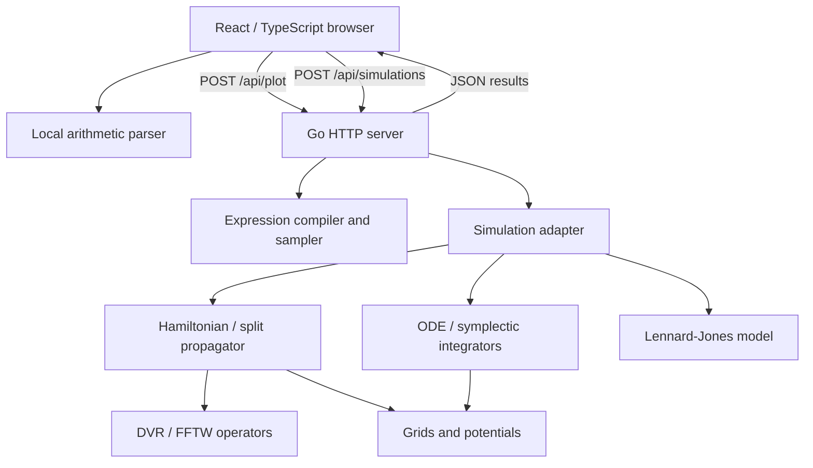

# Architecture and boundaries

[Documentation index](README.md)

## Purpose and execution model

The repository combines reusable Go numerical code with a local scientific web
interface. Go samples expression grids, constructs Hamiltonians, diagonalizes
matrices and integrates trajectories. TypeScript handles forms, response validation,
presentation and small calculator expressions. Bun runs frontend tooling.
TypeScript compiles to JavaScript; its types alone are not a security boundary.

The active workspaces are `/#tools` and `/#calculations`. There is no database,
account system, persistent job queue or remote computation service. Reloading the
page loses in-memory results. The landing page also contains aspirational copy
that exceeds the implemented scope; see [status](11-status-and-limitations.md).

## Deployment paths

`bun run build` creates `webpage/web-app/dist`. `go run ./cmd/web` serves it and
the API at port 8080. Bun is not the production HTTP server. Hash routes stay in
the browser; Go receives `/`, not `/#calculations`.

During development, Vite serves source and proxies `/api` to Go on 8080. Both
development and preview proxies are configured in `vite.config.ts`. React edits
normally hot reload; Go changes require a restart. Windows/WSL file watching may
also require restarting Vite.

## Lifecycle of a calculation

1. The user presses Run; the frontend snapshots the submitted settings.
2. It sends JSON with an `AbortSignal`.
3. Go checks content type, body size, JSON shape and available capacity.
4. The simulation validator checks the model parameters and job size.
5. An isolated job constructs its operators and performs all integration steps.
6. Only bounded output samples are retained for plots and playback.
7. The complete response returns metrics, charts, notes and optional particle frames.
8. TypeScript validates dimensions and finite values before rendering.

There is no streaming progress endpoint. Playback replays computed samples; it
does not integrate equations or calculate forces in the browser.

## Ownership, cancellation and concurrency

Each quantum job creates a Hamiltonian and defers `Close()`. Work buffers are reused
within the job. A Hamiltonian, split propagator or raw Fourier basis must not be
shared by simultaneous callers. FFTW planning/destruction is serialized by a
package mutex; that does not make shared execution buffers safe.

Each `Handler` permits two simultaneous plots and one simulation, in separate
pools. Full pools return 429 rather than queueing jobs. These are per-handler,
in-process controls, not distributed rate limits. Sampling and integration check
context cancellation. Dense diagonalization cannot be interrupted mid-factorization;
its input size is bounded and the context is checked after it completes.

## Performance

| Operation | Main scaling | Current approach |
| --- | --- | --- |
| Plot sampling | Samples × expression cost | Compile expression once; bounded resolution |
| DVR application | O(N²), O(N²) matrix storage | Cached matrix and reusable Hamiltonian buffers |
| Fourier application | O(N log N), O(N) working storage | Reused FFTW plans and arrays |
| Dense eigensystem | Typically O(N³), O(N²) storage | Web N limited to 192 |
| Split propagation | Dense setup; O(N²) per step | Cache kinetic eigensystem once per job |
| Ralston/Nyström vector step | Stages × RHS cost | Correct coupled stages; stage arrays allocated per step |
| Fluid force evaluation | O(P²) per step | P limited to 64; no neighbor list |
| Particle playback | O(P) per frame | Render stored coordinates |

Fourier Hamiltonian application uses FFTs, but the current split propagator uses
a dense kinetic eigensystem even for that basis. Selecting Fourier does not turn
split propagation into an FFT split-step implementation.

Cartesian and GL3D Plotly bundles load separately on demand. They are still large;
JSON serialization and browser rendering may dominate a small numerical run.

## Scientific scope

Quantum and single-particle models are one-dimensional. The separate fluid is
two-dimensional. A 3D expression surface or isosurface does not imply a 3D quantum
solver. There are no electronic-structure methods, chemical atom types, molecular
topology inputs, GPU kernels or trajectory database. Exact bounds are in the
[API reference](08-http-api.md).
